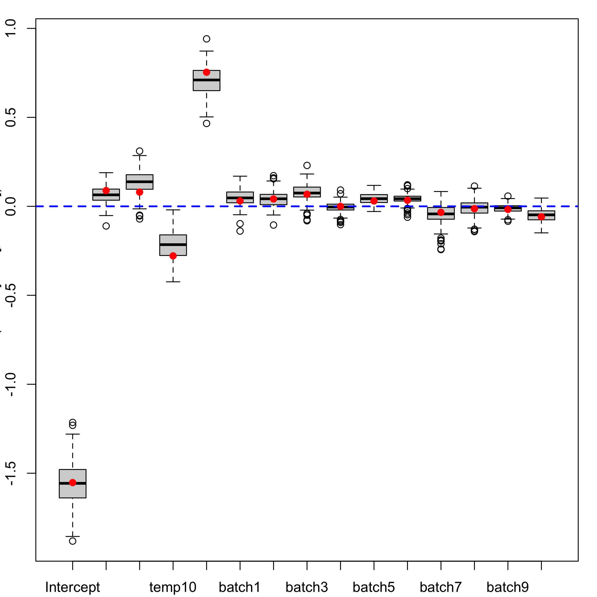
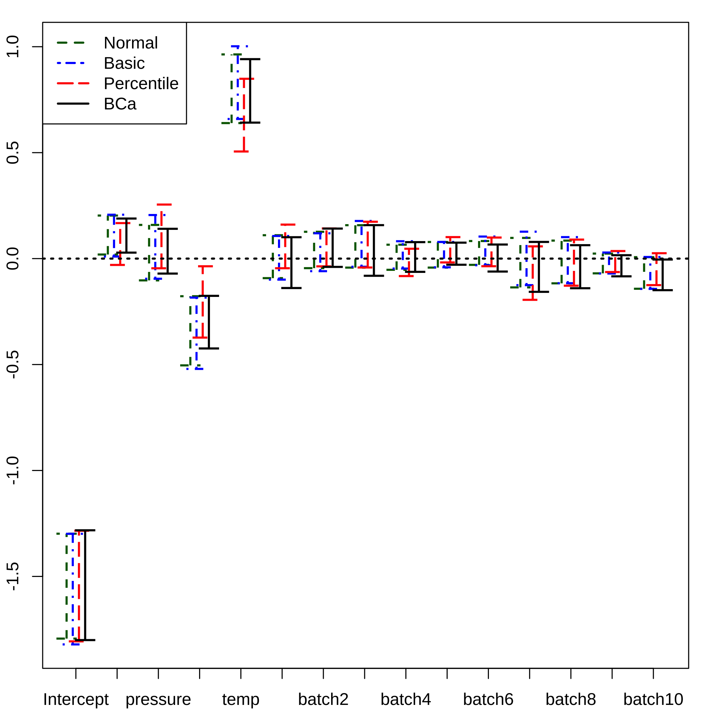

[](https://cran.r-project.org/package=plsRbeta)

<!-- README.md is generated from README.Rmd. Please edit that file -->


# plsRbeta

The goal of plsRbeta is to provide Partial least squares Regression for (weighted) beta regression models (Bertrand 2013,  <http://journal-sfds.fr/article/view/215>) and k-fold cross-validation of such models using various criteria. It allows for missing data in the explanatory variables. Bootstrap confidence intervals constructions are also available.

## Installation

You can install the released version of plsRbeta from [CRAN](https://CRAN.R-project.org) with:


```r
install.packages("plsRbeta")
```

You can install the development version of plsRbeta from [github](https://github.com) with:


```r
devtools::install_github("fbertran/plsRbeta")
```

## Example

### Using a model matrix
Fit a plsRbeta model using a model matrix.


```r
data("GasolineYield",package="betareg")
yGasolineYield <- GasolineYield$yield
XGasolineYield <- GasolineYield[,2:5]
library(plsRbeta)
modpls <- plsRbeta(yGasolineYield,XGasolineYield,nt=3,modele="pls-beta")
#> ____************************************************____
#> 
#> Model: pls-beta 
#> 
#> Link: logit 
#> 
#> Link.phi: 
#> 
#> Type: ML 
#> 
#> ____Component____ 1 ____
#> ____Component____ 2 ____
#> ____Component____ 3 ____
#> ____Predicting X without NA neither in X nor in Y____
#> ****________________________________________________****
print(modpls)
#> Number of required components:
#> [1] 3
#> Number of successfully computed components:
#> [1] 3
#> Coefficients:
#>                   [,1]
#> Intercept -3.324462301
#> gravity    0.001577508
#> pressure   0.072027686
#> temp10    -0.008398771
#> temp       0.010365973
#> Information criteria and Fit statistics:
#>                  AIC        BIC Chi2_Pearson_Y      RSS_Y pseudo_R2_Y
#> Nb_Comp_0  -52.77074  -49.83927       30.72004 0.35640772          NA
#> Nb_Comp_1 -112.87383 -108.47662       30.57369 0.05211039   0.8498691
#> Nb_Comp_2 -136.43184 -130.56889       30.97370 0.02290022   0.9256771
#> Nb_Comp_3 -139.08440 -131.75572       31.08224 0.02022386   0.9385887
#>                R2_Y
#> Nb_Comp_0        NA
#> Nb_Comp_1 0.8537900
#> Nb_Comp_2 0.9357471
#> Nb_Comp_3 0.9432564
```

Additionnal values can be retrieved from the fitted model.

```r
modpls$pp
#>             Comp_ 1    Comp_ 2    Comp_ 3
#> gravity   0.4590380 -0.4538663 -2.5188256
#> pressure  0.6395524 -0.4733525  0.6488823
#> temp10   -0.5435643  0.5292108 -1.3295905
#> temp      0.5682795  0.5473174 -0.2156423
modpls$Coeffs
#>                   [,1]
#> Intercept -3.324462301
#> gravity    0.001577508
#> pressure   0.072027686
#> temp10    -0.008398771
#> temp       0.010365973
modpls$Std.Coeffs
#>                   [,1]
#> Intercept -1.547207760
#> gravity    0.008889933
#> pressure   0.188700277
#> temp10    -0.315301400
#> temp       0.723088387
modpls$InfCrit
#>                  AIC        BIC Chi2_Pearson_Y      RSS_Y pseudo_R2_Y
#> Nb_Comp_0  -52.77074  -49.83927       30.72004 0.35640772          NA
#> Nb_Comp_1 -112.87383 -108.47662       30.57369 0.05211039   0.8498691
#> Nb_Comp_2 -136.43184 -130.56889       30.97370 0.02290022   0.9256771
#> Nb_Comp_3 -139.08440 -131.75572       31.08224 0.02022386   0.9385887
#>                R2_Y
#> Nb_Comp_0        NA
#> Nb_Comp_1 0.8537900
#> Nb_Comp_2 0.9357471
#> Nb_Comp_3 0.9432564
modpls$PredictY[1,]
#>   gravity  pressure    temp10      temp 
#>  2.049533  1.686655 -1.371820 -1.821977
rm("modpls")
```

###Formula support

Fit a plsRbeta model using formula support.

```r
data("GasolineYield",package="betareg")
modpls <- plsRbeta(yield~.,data=GasolineYield,nt=3,modele="pls-beta", verbose=FALSE)
print(modpls)
#> Number of required components:
#> [1] 3
#> Number of successfully computed components:
#> [1] 3
#> Coefficients:
#>                    [,1]
#> Intercept -4.1210566077
#> gravity    0.0157208676
#> pressure   0.0305159627
#> temp10    -0.0074167766
#> temp       0.0108057945
#> batch1     0.0910284843
#> batch2     0.1398537354
#> batch3     0.2287070465
#> batch4    -0.0008124326
#> batch5     0.1018679027
#> batch6     0.1147971957
#> batch7    -0.1005469609
#> batch8    -0.0447907428
#> batch9    -0.0706292318
#> batch10   -0.1984703429
#> Information criteria and Fit statistics:
#>                  AIC        BIC Chi2_Pearson_Y      RSS_Y pseudo_R2_Y
#> Nb_Comp_0  -52.77074  -49.83927       30.72004 0.35640772          NA
#> Nb_Comp_1  -87.96104  -83.56383       31.31448 0.11172576   0.6879757
#> Nb_Comp_2 -114.10269 -108.23975       33.06807 0.04650238   0.8671800
#> Nb_Comp_3 -152.71170 -145.38302       30.69727 0.01138837   0.9526757
#>                R2_Y
#> Nb_Comp_0        NA
#> Nb_Comp_1 0.6865226
#> Nb_Comp_2 0.8695248
#> Nb_Comp_3 0.9680468
```

Additionnal values can be retrieved from the fitted model.

```r
modpls$pp
#>              Comp_ 1     Comp_ 2     Comp_ 3
#> gravity   0.37895923 -0.42864981  0.50983922
#> pressure  0.61533000 -0.41618828 -0.01737302
#> temp10   -0.50627633  0.47379983 -0.47750566
#> temp      0.30248369  0.60751756  0.28239621
#> batch1    0.50274128 -0.30221156 -0.25801764
#> batch2   -0.14241033 -0.13859422  0.80068659
#> batch3   -0.04388172 -0.17303214  0.48564161
#> batch4    0.11299471 -0.08302689  0.04755182
#> batch5    0.23341035  0.08396326 -0.51238456
#> batch6    0.07974302  0.07209943 -0.30710455
#> batch7   -0.37365392 -0.02133356  0.81852001
#> batch8   -0.12891598  0.16967195 -0.06904725
#> batch9   -0.02230288  0.19425476 -0.57189134
#> batch10  -0.25409429  0.28587553 -0.61277072
modpls$Coeffs
#>                    [,1]
#> Intercept -4.1210566077
#> gravity    0.0157208676
#> pressure   0.0305159627
#> temp10    -0.0074167766
#> temp       0.0108057945
#> batch1     0.0910284843
#> batch2     0.1398537354
#> batch3     0.2287070465
#> batch4    -0.0008124326
#> batch5     0.1018679027
#> batch6     0.1147971957
#> batch7    -0.1005469609
#> batch8    -0.0447907428
#> batch9    -0.0706292318
#> batch10   -0.1984703429
modpls$Std.Coeffs
#>                    [,1]
#> Intercept -1.5526788976
#> gravity    0.0885938394
#> pressure   0.0799466278
#> temp10    -0.2784359925
#> temp       0.7537685874
#> batch1     0.0305865495
#> batch2     0.0414169259
#> batch3     0.0677303525
#> batch4    -0.0002729861
#> batch5     0.0301676274
#> batch6     0.0339965674
#> batch7    -0.0337848600
#> batch8    -0.0132645358
#> batch9    -0.0173701781
#> batch10   -0.0587759166
modpls$InfCrit
#>                  AIC        BIC Chi2_Pearson_Y      RSS_Y pseudo_R2_Y
#> Nb_Comp_0  -52.77074  -49.83927       30.72004 0.35640772          NA
#> Nb_Comp_1  -87.96104  -83.56383       31.31448 0.11172576   0.6879757
#> Nb_Comp_2 -114.10269 -108.23975       33.06807 0.04650238   0.8671800
#> Nb_Comp_3 -152.71170 -145.38302       30.69727 0.01138837   0.9526757
#>                R2_Y
#> Nb_Comp_0        NA
#> Nb_Comp_1 0.6865226
#> Nb_Comp_2 0.8695248
#> Nb_Comp_3 0.9680468
modpls$PredictY[1,]
#>    gravity   pressure     temp10       temp     batch1     batch2 
#>  2.0495333  1.6866554 -1.3718198 -1.8219769  2.6040833 -0.3165683 
#>     batch3     batch4     batch5     batch6     batch7     batch8 
#> -0.3165683 -0.3720119 -0.3165683 -0.3165683 -0.3720119 -0.3165683 
#>     batch9    batch10 
#> -0.2541325 -0.3165683
```

###Information criteria and cross validation


```r
data("GasolineYield",package="betareg")
set.seed(1)
bbb <- PLS_beta_kfoldcv_formula(yield~.,data=GasolineYield,nt=3,modele="pls-beta",verbose=FALSE)
kfolds2CVinfos_beta(bbb)
#> ____************************************************____
#> 
#> Model: pls-beta 
#> 
#> Link: logit 
#> 
#> Link.phi: 
#> 
#> Type: ML 
#> 
#> ____Component____ 1 ____
#> ____Component____ 2 ____
#> ____Component____ 3 ____
#> ____Predicting X without NA neither in X or Y____
#> ****________________________________________________****
#> 
#> NK: 1
#> [[1]]
#>                  AIC        BIC Q2Chisqcum_Y  limQ2 Q2Chisq_Y
#> Nb_Comp_0  -52.77074  -49.83927           NA     NA        NA
#> Nb_Comp_1  -87.96104  -83.56383    -1.121431 0.0975 -1.121431
#> Nb_Comp_2 -114.10269 -108.23975    -5.291744 0.0975 -1.965802
#> Nb_Comp_3 -152.71170 -145.38302   -11.583916 0.0975 -1.000068
#>           PREChi2_Pearson_Y Chi2_Pearson_Y      RSS_Y pseudo_R2_Y
#> Nb_Comp_0                NA       30.72004 0.35640772          NA
#> Nb_Comp_1          65.17044       31.31448 0.11172576   0.6879757
#> Nb_Comp_2          92.87255       33.06807 0.04650238   0.8671800
#> Nb_Comp_3          66.13838       30.69727 0.01138837   0.9526757
#>                R2_Y
#> Nb_Comp_0        NA
#> Nb_Comp_1 0.6865226
#> Nb_Comp_2 0.8695248
#> Nb_Comp_3 0.9680468
```

###Bootstrap of the coefficients

Computing bootstrap distributions

```r
data("GasolineYield",package="betareg")
set.seed(1)
GazYield.boot <- bootplsbeta(modpls, sim="ordinary", stype="i", R=250)
```

Boxplots of the bootstrap distributions

```r
plsRglm::boxplots.bootpls(GazYield.boot)
```



Confidence intervals for the coefficients of the model based on the bootstrap distributions

```r
plsRglm::confints.bootpls(GazYield.boot)
#>                                                                         
#> Intercept -1.79344379 -1.298344159 -1.820910539 -1.298811257 -1.80654654
#> gravity    0.01927751  0.203207700  0.009687132  0.207137136 -0.02994946
#> pressure  -0.10284957  0.158899010 -0.095122794  0.205604518 -0.04571126
#> temp10    -0.50396889 -0.177603439 -0.520653497 -0.184002462 -0.37286952
#> temp       0.63958439  0.963623548  0.658889299  1.002068184  0.50546899
#> batch1    -0.09222398  0.110336215 -0.099261768  0.106680396 -0.04550730
#> batch2    -0.04513338  0.126556137 -0.059420084  0.119437955 -0.03660410
#> batch3    -0.04255156  0.157619185 -0.038503175  0.177505160 -0.04204445
#> batch4    -0.05292024  0.065545216 -0.047023003  0.081938870 -0.08248484
#> batch5    -0.04251041  0.078338536 -0.041090268  0.078484689 -0.01814943
#> batch6    -0.02959175  0.082854597 -0.031393204  0.104052342 -0.03605921
#> batch7    -0.13595057  0.097613550 -0.125280057  0.127028728 -0.19459845
#> batch8    -0.11677718  0.084955543 -0.116202080  0.101367639 -0.12789671
#> batch9    -0.06966369  0.023673543 -0.070353628  0.028700049 -0.06344040
#> batch10   -0.14231213  0.006802744 -0.142929452  0.007651461 -0.12520329
#>                                               
#> Intercept -1.28444726 -1.80046767 -1.282289852
#> gravity    0.16750055  0.02817987  0.189061113
#> pressure   0.25501605 -0.07071644  0.140622124
#> temp10    -0.03621849 -0.42413912 -0.175831698
#> temp       0.84864788  0.64173410  0.941303333
#> batch1     0.16043487 -0.13892632  0.100909676
#> batch2     0.14225394 -0.03921924  0.141666087
#> batch3     0.17396388 -0.08110506  0.157875292
#> batch4     0.04647703 -0.06253836  0.077670517
#> batch5     0.10142552 -0.02899872  0.075247803
#> batch6     0.09938634 -0.06114337  0.066367369
#> batch7     0.05771034 -0.15688005  0.078620504
#> batch8     0.08967301 -0.13986427  0.063261668
#> batch9     0.03561327 -0.08371923  0.016030629
#> batch10    0.02537762 -0.14907794 -0.004437664
#> attr(,"typeBCa")
#> [1] TRUE
```

Plot of the confidence intervals for the coefficients of the model based on the bootstrap distributions

```r
plsRglm::plots.confints.bootpls(plsRglm::confints.bootpls(GazYield.boot))
```


